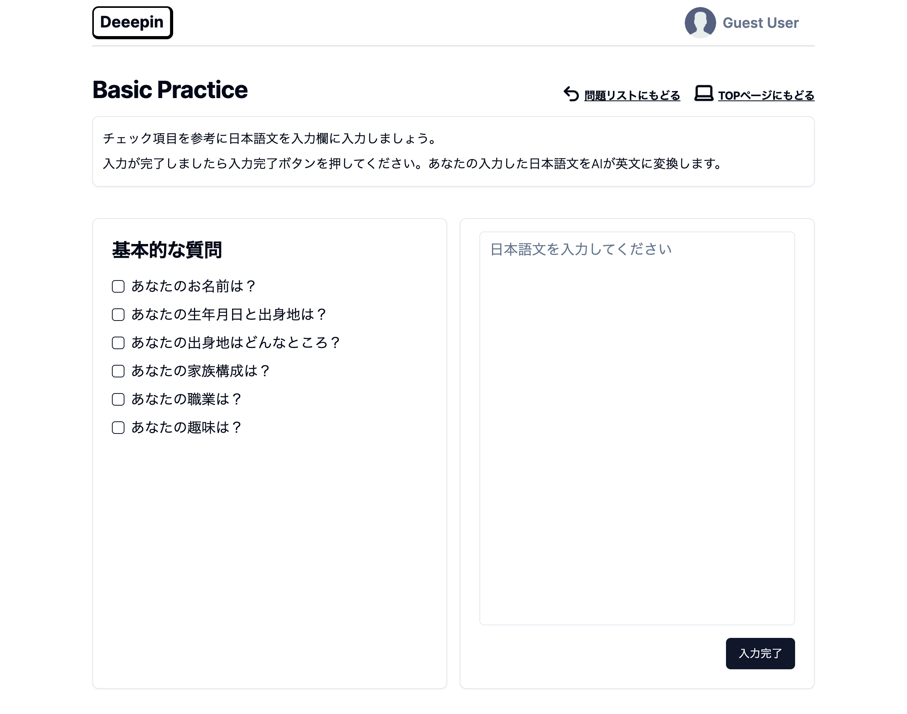

## <u>Learn English with AI</u>

##### <概要>

OpenAIのAPIを活用した作品です。
ユーザーが入力した日本語をAIが英訳します。
その英語を基に英語表現の幅を広げることを目的としたサイトです。
APIとのデータのやり取り、バックエンドでの処理に触れてみたく作成しました。
※ planetScaleのhobbyプラン廃止のため、現在休止中です。

##### <製作日>

2023年11月（制作期間：約1ヶ月）

##### <仕様>

- Basic PracticeとMiddle Practiceが用意されています。
- Basic Practiceではテーマに沿って日本語を作文、Middle Practiceでは自由作文です。
- 入力された日本語文をAIが "easy", "normal", "hard"の三段階の英語レベルで英訳します。

##### <使用技術>

Next.js(app router), microCMS, prisma, planetScale, zod, openAIapi, tailwind, shadcn, typescript, etc

##### <参考URL>

< Youtube >

- [Build & Deploy: Full Stack AI Quiz Platform with NextJS 13, TailwindCSS, OpenAI, Next Auth](https://www.youtube.com/watch?v=vIyU4nInlt0&t=9194s)

< prisma >
- [prisma refarence](https://www.prisma.io/docs/orm/reference) 
- [prisma - getting environment variable not found error message when running graphql query](https://stackoverflow.com/questions/67796217/prisma-getting-environment-variable-not-found-error-message-when-running-graph)
- [webアプリ開発における環境変数まわりのベストプラクティス](https://zenn.dev/dove/articles/5fd7926e7da949)

< zod >
- [zod](https://zod.dev/)
- [TypeScript開発に欠かせない？Zodライブラリの基本](https://dev.classmethod.jp/articles/basic_usage_zod/)
- [zod を実際のプロジェクトで使う時にどうするか考えた](https://qiita.com/punkshiraishi/items/581680537e688bb9ada0)

< React Query >
- [useMutation](https://tanstack.com/query/v4/docs/framework/react/reference/useMutation)
- [React Query useMutation Hook](https://medium.com/@mitchelldalehein25/react-query-usemutation-hook-2603f103f9a3)
- [非同期処理に疲れた方に、ReactQueryの処方箋](https://zenn.dev/t_keshi/articles/react-query-prescription)
- [React Queryはデータフェッチライブラリではない。非同期の状態管理ライブラリだ。](https://zenn.dev/hrbrain/articles/f5ef3016ed7a3a)
- [React Query-データ更新編](https://zenn.dev/akineko/articles/65eb83fe43ae57)